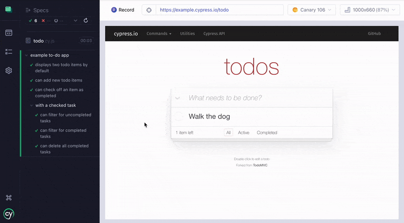
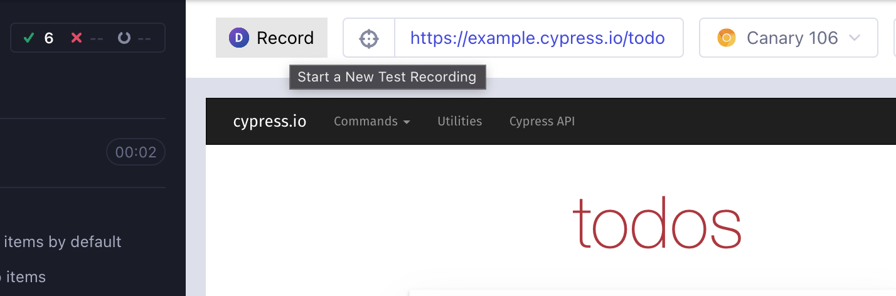

# DeploySentinel Cypress Recorder Plugin

Create Cypress tests scripts within the Cypress test browser by simply
interacting with your application, similar to the previous
[Cypress Studio](https://docs.cypress.io/guides/references/cypress-studio)
functionality previously available in Cypress v9. This plugin will allow you to
translate clicks, inputs, and other events into a Cypress script.



Built on top of the
[DeploySentinel Recorder Browser Extension](https://www.deploysentinel.com/recorder).

**Plugin only works for Cypress v10, not with v9 and below, currently compatible
with Chrome and Firefox**

## Get Started

### Install the plugin

```
npm install -D @deploysentinel/cypress-recorder
```

OR

```
yarn add --dev @deploysentinel/cypress-recorder
```

### Add Plugin to Cypress Config

Add the plugin to your `cypress.config.js` file:

```js
const { defineConfig } = require("cypress");

module.exports = defineConfig({
  e2e: {
    setupNodeEvents(on, config) {
      // Add plugin import here 👇
      require("@deploysentinel/cypress-recorder")(on, config);
    },
  },
});
```

### Use the Recorder

Run Cypress in `open` mode, select a spec to run, and then click "Record" button
on the top left of the test application panel to start recording.



Read more on how to add text assertions, hover events and screenshots in the
[DeploySentinel Recorder extension docs](https://www.deploysentinel.com/docs/recorder).

---

## Made with ❤️ by [DeploySentinel](https://deploysentinel.com)

Use DeploySentinel to save hours of failed Cypress test debugging by using DOM,
network, and console events captured from your CI.
[Learn more.](https://deploysentinel.com)
